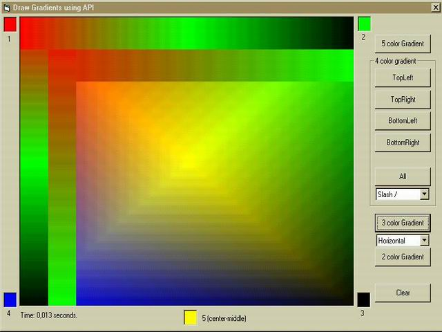



## Gradient with 2, 3, 4, 5 colors using API

### Description

Draw gdadient with 2, 3, 4, 5 colors using API

I have see similar code here (using API) for some gradient effects, but I haven't found a project that give the users the option to select the colors to draw the gradient.

<> 2 colors -> the classic (horizontal or vertical)

<> 3 colors -> same as above, but with a 3rd color in the middle

<> 4 colors -> each color in a corner

<> 5 colors -> 4 colors in the corners and 1 in the middle

(the screen shot isn't good)
 
### More Info
 

             |
---                |---
**Submitted On**   |2002-04-12 11:09:06
**By**             |[UserXP](https://github.com/Planet-Source-Code/PSCIndex/blob/master/ByAuthor/userxp.md)
**Level**          |Intermediate
**User Rating**    |4.6 (23 globes from 5 users)
**Compatibility**  |VB 6\.0
**Category**       |[Graphics](https://github.com/Planet-Source-Code/PSCIndex/blob/master/ByCategory/graphics__1-46.md)
**World**          |[Visual Basic](https://github.com/Planet-Source-Code/PSCIndex/blob/master/ByWorld/visual-basic.md)
**Archive File**   |[Gradient\_w712794122002\.zip](https://github.com/Planet-Source-Code/userxp-gradient-with-2-3-4-5-colors-using-api__1-33727/archive/master.zip)

### API Declarations

GradientFill from msimg32

